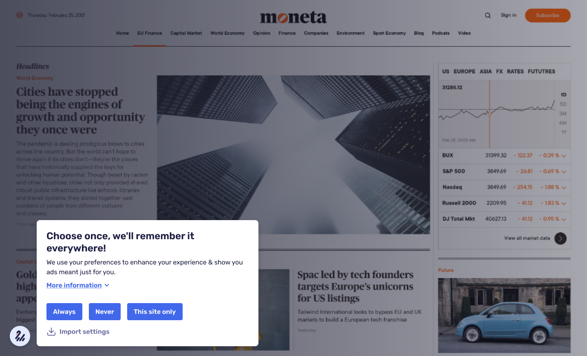
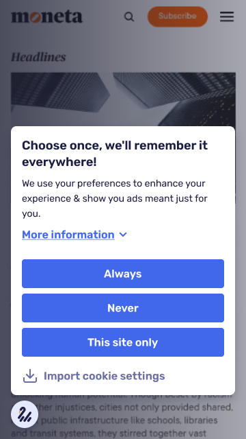

  

# Secured Web Addressability Network (SWAN) UI Design

Hello! :wave:

You are reading about a reference user interface design for a modern consent management solution.

The UX and UI design was created by <a href="https://dotcreative.hu" target="_blank">Dot Creative Digital Agency</a> after testing and re-thinking the demo of SWAN. The aim was to create a cookie compilance that was both familiar for the users and innovative. It was important to us make the consent managemet aesthetically pleasing, not ostentatious, and to be able to easily integrate it into any website.
  

> :warning: Please use the **Figma links** published below, instead of the .fig file in this repository what is only for backup.

 

---

## Design

### Desktop

The links below will take you to the design for the desktop view, which will help you with the development, and the prototype, which will guide you through the process.

<figure>

<figcaption><i>SWAN consent management first step screenshot - Desktop view</i></figcaption>
</figure>

- <a href="https://www.figma.com/file/ZYRwW8OWycoVqV45yH8Lt0/SWAN-UI-design?node-id=632%3A530" target="_blank">Design</a> :link:
- <a href="https://www.figma.com/proto/ZYRwW8OWycoVqV45yH8Lt0/SWAN-UI-design?page-id=632%3A530&node-id=632%3A550&viewport=245%2C48%2C0.65&scaling=scale-down&starting-point-node-id=632%3A550&hide-ui=1" target="_blank">Prototype</a> :link:
  

### Mobile

The links below will take you to the design for the mobile view, which will help you with the development, and the prototype, which will guide you through the process.

<figure>

<figcaption><i>SWAN consent management first step screenshot - Mobile view</i></figcaption>
</figure>
 

- <a href="https://www.figma.com/file/ZYRwW8OWycoVqV45yH8Lt0/SWAN-UI-design?node-id=727%3A3701" target="_blank">Design</a> :link:
- <a href="https://www.figma.com/proto/ZYRwW8OWycoVqV45yH8Lt0/SWAN-UI-design?page-id=727%3A3701&node-id=727%3A3702&viewport=245%2C48%2C0.05&scaling=scale-down&starting-point-node-id=727%3A3702&hide-ui=1" target="_blank">Prototype</a> :link:

 

---

## Design Guide

In future developments, the Design Guide will help to maintain a consistent and stable look for SWAN.

The full Design Guide is available at this link as a Figma prototype: 
<a href="https://www.figma.com/proto/ZYRwW8OWycoVqV45yH8Lt0/SWAN-UI-design?page-id=1013%3A8976&node-id=1153%3A9876&viewport=245%2C48%2C0.34&scaling=scale-down-width&starting-point-node-id=1153%3A9876&hide-ui=1" target="_blank">Design Guide</a>

 

### Table of contents

The guides for each element are linked below.

- <a href="https://www.figma.com/proto/ZYRwW8OWycoVqV45yH8Lt0/SWAN-UI-design?page-id=1013%3A8976&node-id=1153%3A9876&viewport=245%2C48%2C0.34&scaling=scale-down-width&starting-point-node-id=1153%3A9876&hide-ui=1" target="_blank">Overview</a> :link:
- <a href="https://www.figma.com/proto/ZYRwW8OWycoVqV45yH8Lt0/SWAN-UI-design?page-id=1013%3A8976&node-id=1013%3A10219&viewport=245%2C48%2C0.34&scaling=scale-down-width&starting-point-node-id=1153%3A9876&hide-ui=1" target="_blank">Colors</a> :link:
- <a href="https://www.figma.com/proto/ZYRwW8OWycoVqV45yH8Lt0/SWAN-UI-design?page-id=1013%3A8976&node-id=1020%3A9368&viewport=245%2C48%2C0.34&scaling=scale-down-width&starting-point-node-id=1153%3A9876&hide-ui=1" target="_blank">Typography</a> :link:
- <a href="https://www.figma.com/proto/ZYRwW8OWycoVqV45yH8Lt0/SWAN-UI-design?page-id=1013%3A8976&node-id=1082%3A11003&viewport=245%2C48%2C0.34&scaling=scale-down-width&starting-point-node-id=1153%3A9876&hide-ui=1" target="_blank">Grid & layout</a> :link:
- <a href="https://www.figma.com/proto/ZYRwW8OWycoVqV45yH8Lt0/SWAN-UI-design?page-id=1013%3A8976&node-id=1074%3A10138&viewport=245%2C48%2C0.34&scaling=scale-down-width&starting-point-node-id=1153%3A9876&hide-ui=1" target="_blank">Inputs</a> :link:
- <a href="https://www.figma.com/proto/ZYRwW8OWycoVqV45yH8Lt0/SWAN-UI-design?page-id=1013%3A8976&node-id=1100%3A9938&viewport=245%2C48%2C0.34&scaling=scale-down-width&starting-point-node-id=1153%3A9876&hide-ui=1" target="_blank">Buttons</a> :link:
- <a href="https://www.figma.com/proto/ZYRwW8OWycoVqV45yH8Lt0/SWAN-UI-design?page-id=1013%3A8976&node-id=1137%3A10873&viewport=245%2C48%2C0.34&scaling=scale-down-width&starting-point-node-id=1153%3A9876&hide-ui=1" target="_blank">Modals & dialogs</a> :link:
- <a href="https://www.figma.com/proto/ZYRwW8OWycoVqV45yH8Lt0/SWAN-UI-design?page-id=1013%3A8976&node-id=1145%3A11298&viewport=245%2C48%2C0.34&scaling=scale-down-width&starting-point-node-id=1153%3A9876&hide-ui=1" target="_blank">Notifications</a> :link:
- <a href="https://www.figma.com/proto/ZYRwW8OWycoVqV45yH8Lt0/SWAN-UI-design?page-id=1013%3A8976&node-id=1146%3A10117&viewport=245%2C48%2C0.34&scaling=scale-down-width&starting-point-node-id=1153%3A9876&hide-ui=1" target="_blank">Navigation</a> :link:
- <a href="https://www.figma.com/proto/ZYRwW8OWycoVqV45yH8Lt0/SWAN-UI-design?page-id=1013%3A8976&node-id=1108%3A9697&viewport=245%2C48%2C0.34&scaling=scale-down-width&starting-point-node-id=1153%3A9876&hide-ui=1" target="_blank">Logo</a> :link:
- <a href="https://www.figma.com/proto/ZYRwW8OWycoVqV45yH8Lt0/SWAN-UI-design?page-id=1013%3A8976&node-id=1130%3A10679&viewport=245%2C48%2C0.34&scaling=scale-down-width&starting-point-node-id=1153%3A9876&hide-ui=1" target="_blank">Icons</a> :link:
- <a href="https://www.figma.com/proto/ZYRwW8OWycoVqV45yH8Lt0/SWAN-UI-design?page-id=1013%3A8976&node-id=1146%3A10219&viewport=245%2C48%2C0.34&scaling=scale-down-width&starting-point-node-id=1153%3A9876&hide-ui=1" target="_blank">Animations</a> :link:
- <a href="https://www.figma.com/proto/ZYRwW8OWycoVqV45yH8Lt0/SWAN-UI-design?page-id=1013%3A8976&node-id=1149%3A9819&viewport=245%2C48%2C0.34&scaling=scale-down-width&starting-point-node-id=1153%3A9876&hide-ui=1" target="_blank">Accessibility</a> :link:
- <a href="https://www.figma.com/proto/ZYRwW8OWycoVqV45yH8Lt0/SWAN-UI-design?page-id=1013%3A8976&node-id=1149%3A9949&viewport=245%2C48%2C0.34&scaling=scale-down-width&starting-point-node-id=1153%3A9876&hide-ui=1" target="_blank">Tone of voice</a> :link:

 

## About the creators

Dot Creative is a Digital Agency. Our main profile is UI and UX design, we also design and implement social and media campaigns.

<a href="https://dotcreative.hu" target="_blank">Website</a> | 
<a href="https://dotcreative.hu" target="_blank">LinkedIn</a> | <a href="https://dotcreative.hu" target="_blank">Instagram</a> | <a href="https://dotcreative.hu" target="_blank">Facebook</a>